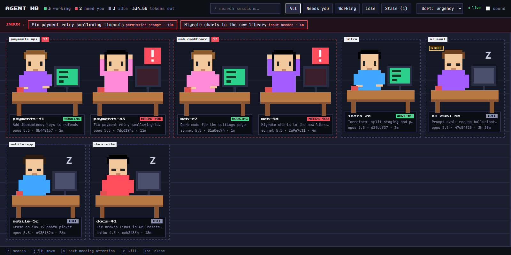
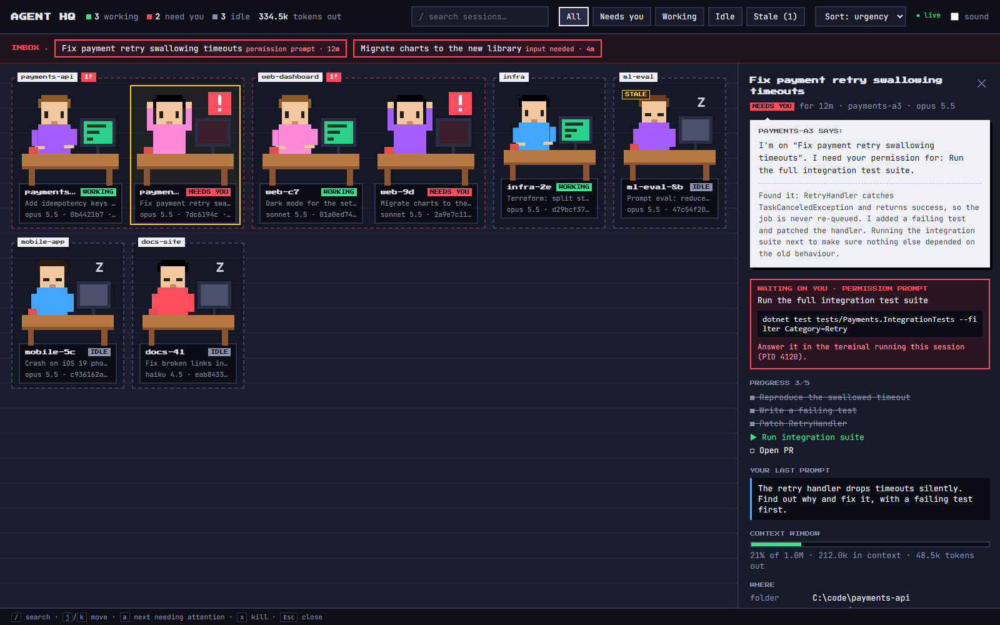
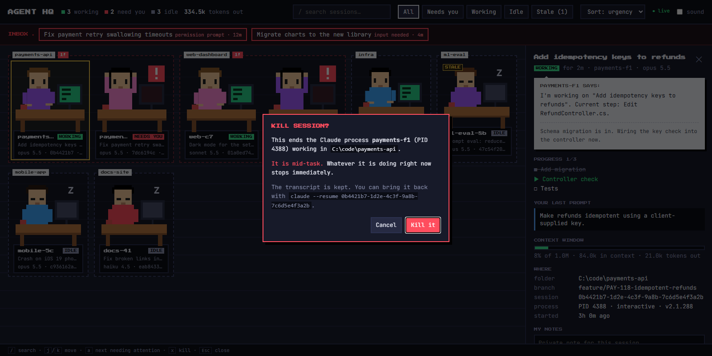

# Agent HQ

A pixel-art office showing every Claude Code session running on this machine: working, idle, or needing you.



Click a desk and the agent explains, in its own words, what it's doing and exactly what it's waiting on:



Kill a stale or runaway session. It always asks first, and the transcript is kept so you can resume it:



*Screenshots use demo data.*

## Run

Double-click `start-agent-hq.cmd`, or run `npm start` and open http://agent-hq.localhost:4319. Needs Node 20+. No dependencies.

It only reads session files while a dashboard tab is open. A second copy exits quietly if one is already running.

### Start at login (hidden)

Run this once in PowerShell. It adds a Startup shortcut that runs the server with no console window:

```powershell
$s = (New-Object -ComObject WScript.Shell).CreateShortcut("$([Environment]::GetFolderPath('Startup'))\Agent HQ.lnk")
$s.TargetPath = 'C:\Windows\System32\conhost.exe'
$s.Arguments = '--headless "C:\Program Files\nodejs\node.exe" "C:\Github\DEADPOOL\server.js"'
$s.WorkingDirectory = 'C:\Github\DEADPOOL'
$s.Save()
```

To undo it, delete `Agent HQ.lnk` from `shell:startup`.

## How it knows what's going on

Nothing to configure. It only reads files Claude Code already writes:

- `~/.claude/sessions/<pid>.json`: Claude's own live registry of running sessions. `status` is `busy` / `waiting` / `idle`, and `waitingFor` says whether it's a permission prompt or a question.
- `~/.claude/projects/<folder>/<sessionId>.jsonl`: the conversation log. This gives the title, your last prompt, the pending tool call, to-dos, edited files, the agent's last message, and token usage.

These are internal Claude Code formats, not a public API, so a future Claude Code update could change them.

**Kill session** runs `taskkill /T /F` on the session's PID, but first checks that the PID still belongs to `claude.exe`/`node.exe`. The transcript is kept, so `claude --resume <id>` brings the session back.

The server listens only on `127.0.0.1` and rejects requests from other origins.

Set `CLAUDE_CONFIG_DIR` if your Claude data lives somewhere other than `~/.claude`, and `PORT` to change the port.
